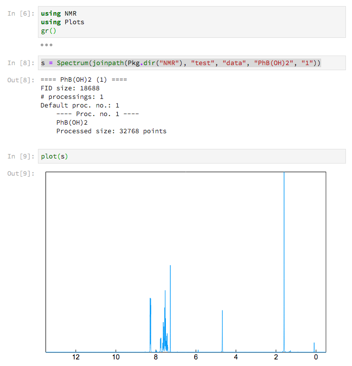

# NMR
This package helps with analysis and visualization of NMR data.

## Implemented features
* Reading and writing Bruker FIDs and processed data
* Importing of acquisition and processing parameters and integration ranges
* Signal interpolation
* Arithmetic operations between NMR spectra
* Signal integration and integral display
* Utility functions for plotting with
  [Plots.jl](https://github.com/JuliaPlots/Plots.jl)
* Least squares signal decomposition

## TODO
* Peak detection
* Window functions
* Automatic phase correction

## Authors
* [S. Hessam M. Mehr](https://hessammehr.github.io) ([github](https://github.com/hessammehr))

## License
MIT

Contributions are very welcome
